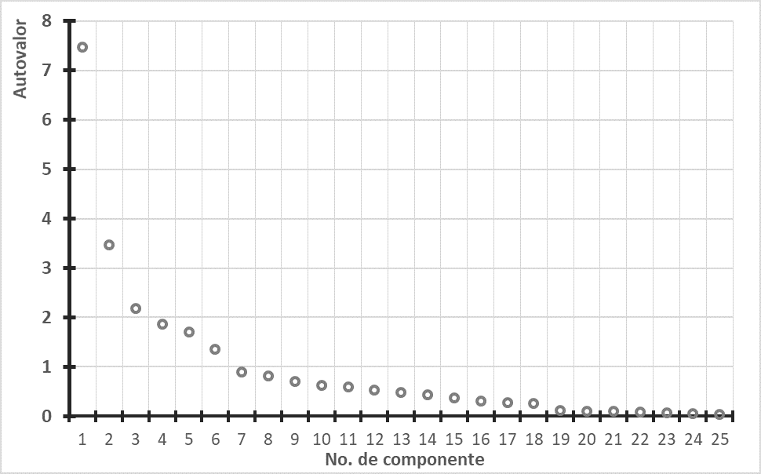

# Quiz 2

1.- A partir de la tabla de varianza total explicada, si se deseara explicar un mínimo del 95% de la variabilidad contenida en los datos, ¿cuántos componentes son necesarios extraer?

| Componente | Total | % de la varianza |
|------------|-------|------------------|
| 1          | 6.691 | 74.344           |
| 2          | 1.245 | 13.831           |
| 3          | 0.532 | 5.907            |
| 4          | 0.198 | 2.196            |
| 5          | 0.174 | 1.932            |
| 6          | 0.066 | 0.729            |
| 7          | 0.056 | 0.621            |
| 8          | 0.025 | 0.28             |
| 9          | 0.014 | 0.159            |

  - 2
  - 3
  - **4**
  - 5

2.- Las variables resultantes del Análisis de Componentes Principales:

(Seleccione una o más de una)

  - Deben presentar una alta correlación entre ellas
  - **Son combinaciones lineales normalizadas de las variables originales**
  - **Intentan explicar la mayor cantidad de varianza contenida en la estructura**
  
3.- El objetivo principal del Análisis de Componentes Principales es:
  - Simplificar la estructura de los datos.
  - Explicar el comportamiento de ciertas variables en función de otras.
  - Realizar una clasificación de los individuos.
  - **Analizar la interdependencia de las variables bajo estudio.**
  
4.- El Análisis de Componentes Principales tiene dentro de sus objetivos:

(Seleccione una o más de una)

  - **Servir como elemento de validación del supuesto de independencia de las variables.**
  - **Reducir el número de variables originales cuando alguna de ellas no aporten información significada para explicar la variabilidad.**
  - Establecer una regla que permita clasificar a los individuos u observaciones de una investigación futura.
  - **Analizar la forma en que se relacionan las variables medidas en el estudio.**

5.- De la siguiente tabla de eigenvalores, ¿cuál de las opciones que se muestran corresponde a la ecuación que representa al segundo componente principal?

| var | C1     | C2      | C3     |
|-----|--------|---------|--------|
| x1  | 0.3879 | -0.3879 | 0.0632 |
| x2  | 0.3998 | 0.3165  | -0.334 |
| x3  | 0.2646 | 0.5432  | 0.7933 |

  - Z2 = 0.3879C1 + 0.3165C2 + 0.7933x3
  - Z2 = 0.3879x1 + 0.3998x2 + 0.2646x3
  - **Z2 = -0.3879x1 + 0.3165x2 + 0.5432x3**
  - Z2 = -0.3879C1 + 0.3879C2 + 0.0632x3

6.- De acuerdo con el siguiente gráfico, si se aplica el método de Kaiser ¿cuántos componentes deberán ser seleccionados?

(Seleccione una)

  - 5  
  - **6**  
  - 7  
  - 8

7.- Se recomienda que cuando las variables no tienen la misma escala de medición se debe de utilizar la _________________(1) . Esto lo que hace es _________________(2) las variables originales para que tengan media de cero y varianza igual a uno.

  (1)
  - Matriz de covarianzas.
  - Matriz ortogonal.  
  - Matriz inversa.
  - **Matriz de correlaciones**.
  
    (2)
  - Complementar.
  - Filtrar.  
  - Descomponer.
  - **Estandarizar**.

8.- Para llevar a cabo el Análisis de Componentes Principales es necesario:

(Seleccione una)

  - Tener un conocimiento previo y detallado de la estructura particular de las variables.
  - Establecer una o varias variables dependientes además de un conjunto de variables independientes.
  - **Tener evidencia de que existe correlación significativa entre las variables originales.**
  
9.- La siguiente gráfica bi-plot recoge las valoraciones que fueron concedidos por los encuestados sobre siete marcas de automóviles en tres características: Elegancia, Comodidad y Deportividad. ¿Cuál de las siguientes afirmaciones son verdaderas?

  - **La marca 5 se caracteriza más por la elegancia y comodidad, pero no es considerada deportiva.**
  - La marca 2 tiene valoraciones más altas en las variables estudiadas que la marca 6.
  - Es probable que la marca 1 tenga valoraciones altas en elegancia y comodidad pero no en deportividad
  - **Las variables Elegancia y Comodidad tienen una correlación alta entre ellas.**
  - **Se puede decir que la marca 3 y 4 son valoradas de forma similar por los encuestados**
  
10.- ¿Cuál(es) de las siguientes aseveraciones es(son) verdadera(s)?
(Seleccione una o más de una)

  - Se pueden tener tantos componentes principales como el no. de variables originales menos una
  - **Los primeros componentes explicarán la mayor cantidad de la variabilidad de los datos**
  - **Los autovectores (eigenvectores) representan el peso o carga que tienen cada variable con respecto a los componentes principales**
