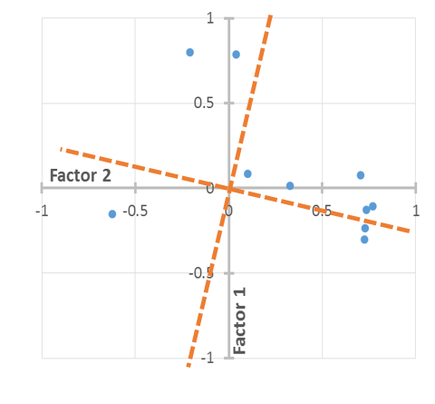
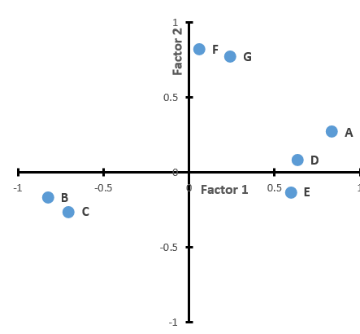

# Quiz

Determine si las afirmaciones siguientes son VERDADERAS o FALSAS:

  - **El Análisis de Factores Comunes y el Análisis de Componentes Principales buscan explicar la estructura de un conjunto de datos**
  - El Análisis de Factores es construido para interpretar la varianza total del conjunto de variables observadas
  - **La correlación entre las variables observadas es un aspecto fundamental para el Análisis de Factores Comunes**
  - El Análisis de Factores Comunes genera un conjunto de ecuaciones de regresión en donde las variables observadas son consideradas como las variables independientes de la ecuación
  - **El Análisis Factorial Exploratorio es recomendado cuando no se tiene un conocimiento previo de la estructura**
  
Al rotar las cargas factoriales se busca principalmente:

  - Tratar de incluir un porcentaje adicional a la varianza explicada por el modelo sin rotar
  - **Facilitar la interpretación de los factores sin alterar la proporción de la varianza comun explicada**
  - Aplicar una prueba capaz de determinar la relevancia del modelo factorial
  - Reducir el número de factores inicialmente considerados
 
De la siguiente tabla, cual es valor de la comunalidad y la varianza específica para la variable  1:

NOTA: La comunalidad se calcula Factor1^2 + Factor2^2 + ... + FactorN^2

| Var   | Factor 1 | Factor 2 | Factor 3 | Factor 4 |
|-------|----------|----------|----------|----------|
| Var 1 | 0.691    | 0.217    | -0.52    | -0.206   |
| Var 2 | 0.789    | 0.184    | -0.193   | 0.092    |
| Var 3 | 0.702    | -0.535   | 0.047    | -0.175   |
| Var 4 | 0.674    | 0.134    | 0.139    | 0.396    |
| Var 5 | 0.62     | 0.551    | -0.084   | -0.419   |

  - Comunalidad = 0.87; Varianza específica = 0.13
  - **Comunalidad = 0.83; Varianza específica = 0.16**
  - Comunalidad = 0.61; Varianza específica = 0.39
  - Comunalidad = 0.81; Varianza específica = 0.19
  
De la siguiente tabla de cargas rotadas, cuales son las variables que presentan una mayor correlación con el primer factor (componente)

| Escala                | CP1       | CP2      |
|-----------------------|-----------|----------|
| Estabilidad emocional | 0.834     | 0.269    |
| Preocupación          | -0.827    | -0.168   |
| Ansiedad inhibidora   | -0.703    | -0.262   |
| Atrevimiento          | 0.633     | 0.084    |
| Control emocional     | 0.593     | -0.132   |
| Razonamiento          | 0.059     | 0.821    |
| Capacidad intelectual |     0.240 |    0.775 |

  - Estabilidad emocional, ansiedad inhibidora, atrevimiento, control emocional
  - **Estabilidad emocional, preocupación, ansiedad inhibidora, atrevimiento, control emocional**
  - Estabilidad emocional, preocupación, atrevimiento, control emocional
  - Estabilidad emocional, preocupación, ansiedad inhibidora, atrevimiento, capacidad intelectual

De acuerdo a la gráfica siguiente, ¿qué tipo de rotación fue realizada?

  - Oblicua
  - **Ortogonal**
  - Isobárica
  - Complementaria
  
El término COMUNALIDAD se refiere a:

  - **Porción de la varianza de una variable que es explicada por los factores comunes**
  - Porción de la varianza propia de la variable que los factores no explican
  - La varianza acumulada del que contiene el modelo
  - La parte de la varianza correspondiente al error originado por la recolección de los datos
  
¿Cuál es el modelo factorial que representa a la siguiente tabla de cargas?

| var   | Factor 1 | Factor 2 | Comunalidad |
|-------|----------|----------|-------------|
| Var 1 | 0.56     | 0.82     | 0.98        |
| Var 2 | 0.78     | -0.53    | 0.88        |
| Var 3 | 0.65     | 0.75     | 0.98        |

  - Var 1 = 0.98 F1 + 0.02 F2 + u1; Var 2 = 0.88 F1 + 0.12 F2 + u2; Var 3 = 0.98 F1 + 0.02 F2 + u3
  - **Var 1 = 0.56 F1 + 0.82 F2 + u1; Var 2 = 0.78 F1 – 0.53 F2 + u2; Var 3 = 0.65 F1 + 0.75 F2 + u3**
  - Var 1 = 0.56 F1 + 0.82 F2 + 0.98; Var 2 = 0.78 F1 – 0.53 F2 + 0.88; Var 3 = 0.65 F1 + 0.75 F2 + 0.98 

De la siguiente gráfica factorial, ¿cuáles son las variables que tienen una correlación fuerte con el primer factor?

Seleccione una:
  - **A, B, C, D, E**
  - F, G
  - A, D, E
  - B, C
